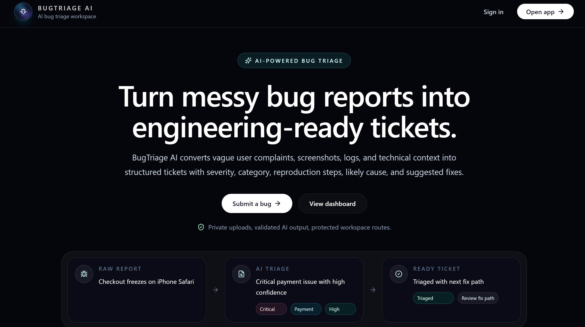
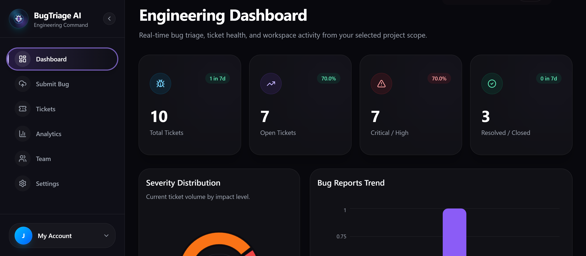
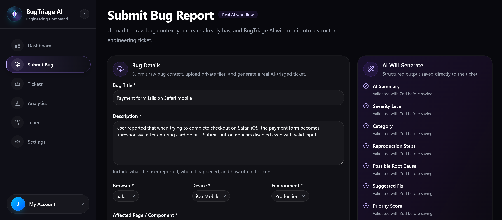
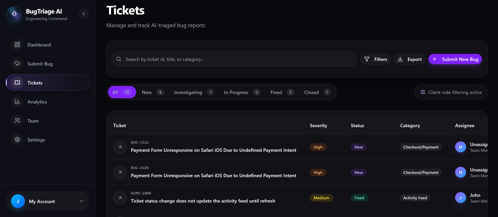

# BugTriage AI

**BugTriage AI** is a modern full-stack AI-powered issue triage platform that turns messy bug reports, screenshots, logs, and user complaints into structured, developer-ready tickets.

It helps teams submit bug details, upload supporting files, and use AI to generate summaries, likely causes, suggested fixes, severity, priority, tags, and confidence scores inside a protected SaaS-style workspace.

[Live Demo](https://bug-triage-ai.vercel.app/) | [Repository](https://github.com/skerdiD/BugTriage-AI)

---
## Preview

### Landing Page Hero



### Engineering Dashboard



### Submit Bug Report



### Tickets Management



---
## Overview

Bug reports are often unclear, incomplete, and scattered across screenshots, logs, support messages, and user complaints.

Developers lose time understanding what happened, how serious the issue is, and what should be fixed first.

BugTriage AI solves this by converting raw reports into structured engineering tickets.

Users can submit bug details, add reproduction steps, upload attachments, manage tickets by workspace and project, and export triaged issues to GitHub.

This project demonstrates full-stack SaaS development, practical AI integration, authentication, authorization, file storage, analytics, testing, monitoring, and production-minded engineering.

---
## Key Features

### AI Bug Triage

- Generate structured tickets from messy reports
- Create AI-powered summaries
- Detect likely causes
- Suggest possible fixes
- Assign severity and priority
- Categorize bug reports
- Return confidence scores
- Validate AI output with Zod
- Handle AI failures safely
- Redact sensitive text

### Bug Submission

- Submit bug titles and descriptions
- Add expected and actual behavior
- Add steps to reproduce
- Include browser, device, and environment details
- Paste console logs
- Upload screenshots, logs, and JSON files
- Connect reports to projects and workspaces

### Ticket Management

- View submitted tickets
- Search and filter tickets
- Track status, severity, priority, and category
- Open ticket detail pages
- Review original reports and AI analysis
- Add comments
- Follow activity history

### Workspaces and Teams

- Supabase authentication
- Protected dashboard routes
- Workspace-based organization
- Project-based ticket grouping
- Owner, admin, and member roles
- Team invitations
- Workspace-level authorization

### Analytics and Activity

- Dashboard overview
- Ticket activity summaries
- Ticket counts by status and severity
- Recent activity feed
- Ticket trend insights
- Activity events

### GitHub Issues Export

- Export tickets to GitHub Issues
- Send structured ticket details
- Include reproduction steps and AI analysis
- Apply useful labels
- Validate GitHub tokens
- Keep export logic server-side

### Security and Reliability

- Protected app routes
- User-scoped ticket access
- Private attachment storage
- Signed download URLs
- AI timeout and retry handling
- Arcjet protection and rate limiting
- Sentry monitoring
- CI quality checks

---
## Tech Stack

### Frontend

- Next.js App Router
- React
- TypeScript
- Tailwind CSS
- shadcn/ui
- Radix UI
- Lucide React
- Recharts
- React Hook Form
- Zod

### Backend and Database

- Next.js Server Actions
- Next.js Server Components
- Next.js API Routes
- Prisma ORM
- Supabase Postgres
- Supabase Auth
- Supabase Storage

### AI Layer

- Vercel AI SDK
- Google Gemini
- `@ai-sdk/google`
- Structured AI output
- Zod validation
- Prompt redaction
- Timeout and retry handling

### Security, Testing, and Deployment

- GitHub Issues REST API
- Arcjet
- Sentry
- Vitest
- Playwright
- GitHub Actions
- ESLint
- TypeScript
- Vercel

---
## Architecture Overview

BugTriage AI uses a full-stack Next.js architecture with Supabase for auth, database, and storage, Prisma for typed database access, Gemini for AI analysis, and GitHub Issues for export.

```txt
Next.js App
  |-- App Router
  |-- React
  |-- TypeScript
  |-- Dashboard
  |-- Tickets
  |-- Submit Bug
  |-- Analytics
  |-- Team
  |-- Settings

Auth and Workspace Layer
  |-- Supabase Authentication
  |-- Protected Routes
  |-- Workspace Access Checks
  |-- Member Roles
  |-- Team Invitations

Server and Data Layer
  |-- Server Components
  |-- Server Actions
  |-- API Routes
  |-- Ticket Actions
  |-- Comment Actions
  |-- Activity Logging
  |-- Prisma ORM
  |-- Supabase Postgres

AI Layer
  |-- Vercel AI SDK
  |-- Google Gemini
  |-- Structured Output
  |-- Summary Generation
  |-- Likely Cause
  |-- Suggested Fix
  |-- Severity
  |-- Priority
  |-- Confidence Score

Integration and Security Layer
  |-- GitHub Issues Export
  |-- Supabase Storage
  |-- Private Attachments
  |-- Signed Download URLs
  |-- Arcjet Protection
  |-- Sentry Monitoring
```

---
## Getting Started

### 1. Clone the repository

```bash
git clone https://github.com/skerdiD/BugTriage-AI.git
cd BugTriage-AI
```

### 2. Install dependencies

```bash
npm install
```

### 3. Create environment variables

Create a `.env.local` file:

```env
NEXT_PUBLIC_SUPABASE_URL=
NEXT_PUBLIC_SUPABASE_ANON_KEY=
SUPABASE_SERVICE_ROLE_KEY=
NEXT_PUBLIC_SUPABASE_STORAGE_BUCKET=bugtriage-private
DATABASE_URL=
DIRECT_URL=
GOOGLE_GENERATIVE_AI_API_KEY=
GITHUB_TOKEN=
ARCJET_KEY=
NEXT_PUBLIC_SENTRY_DSN=
SENTRY_AUTH_TOKEN=
```

### 4. Push the database schema

```bash
npx prisma db push
```

### 5. Seed demo data, optional

```bash
npx prisma db seed
```

### 6. Start the development server

```bash
npm run dev
```

Open the app at:

```txt
http://localhost:3000
```

---
## Available Scripts

```bash
npm run dev
npm run build
npm run start
npm run lint
npm run typecheck
npm run test
npm run test:e2e
npx prisma db push
npx prisma studio
npx prisma generate
```

---
## Author
Built by **skerdiD**.

GitHub: [@skerdiD](https://github.com/skerdiD)