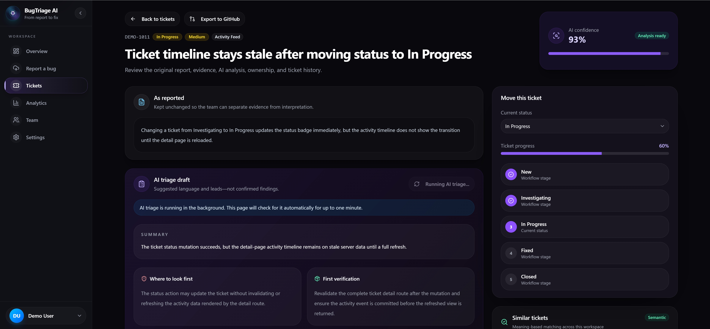
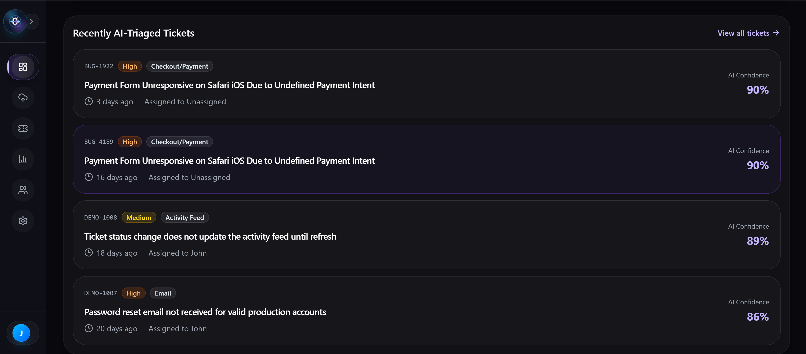
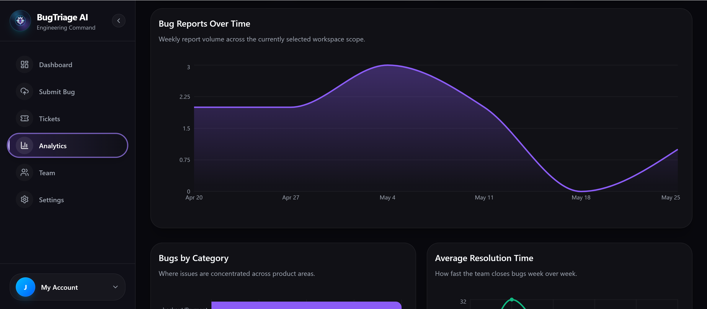
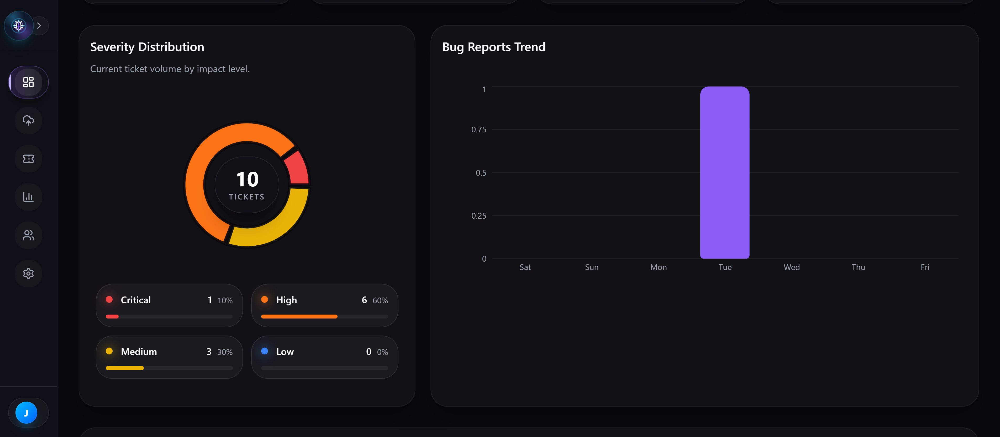
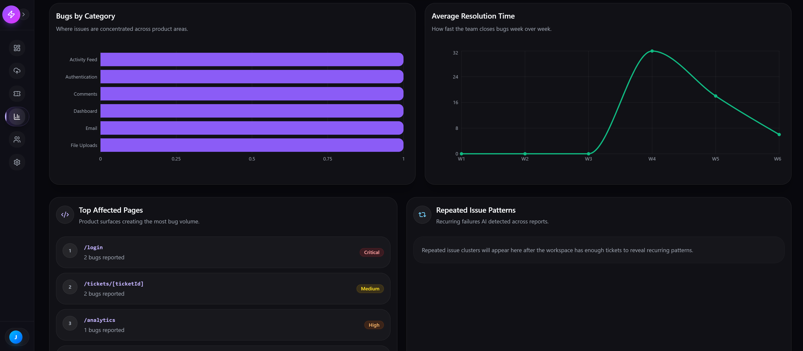
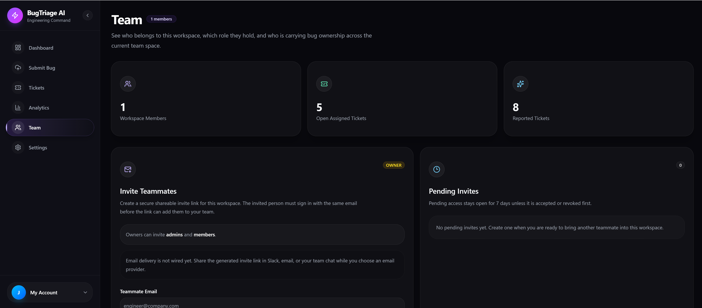

# BugTriage AI

**BugTriage AI** is a full-stack AI-powered issue triage platform built with **Next.js**, **React**, **TypeScript**, **Supabase**, **Prisma**, **PostgreSQL**, **pgvector**, and **Gemini AI**.

It turns messy bug reports, screenshots, logs, and user complaints into structured developer-ready tickets with AI analysis, similar-issue search, workspace permissions, analytics, and GitHub Issues export.

[Live Demo](https://bug-triage-ai.vercel.app/) | [Repository](https://github.com/skerdiD/BugTriage-AI)

---

## Demo Account

Use the **Continue as Demo User** button on the sign-in page, or sign in with:

```txt
Email: demo@bugtriage.ai
Password: Demo1234!
```

The shared demo account is read-only. Its workspace, teammates, tickets, activity,
and AI triage results are fake and may be reset at any time.

---

## Preview

Explore the deployed app: [bug-triage-ai.vercel.app](https://bug-triage-ai.vercel.app/)

### Landing Page




### Engineering Dashboard




### Ticket Workspace


### Analytics and Team






---

## Overview

Most bug tracking demos stop at a basic ticket form. BugTriage AI was built to feel closer to a real SaaS engineering tool for teams that need to turn messy reports into clear, actionable tickets.

Users can submit bug details, add reproduction steps, upload files, manage tickets by workspace and project, generate structured AI analysis, find similar previous issues, and export tickets to GitHub Issues.

The goal was to show more than CRUD: AI structured output, semantic search, workspace authorization, private file handling, analytics, GitHub integration, testing, monitoring, and production-minded engineering.

---

## Business Value

BugTriage AI helps engineering teams reduce time wasted on unclear bug reports by converting messy feedback, screenshots, logs, and complaints into structured tickets.

For clients, it shows the foundation of a practical developer tool where teams can triage faster, detect duplicate issues, prioritize work, organize bug history, and send clean tickets into GitHub Issues.

---

## Key Features

### AI Bug Triage

* Generate structured tickets from messy reports
* Create AI-powered summaries
* Detect likely causes
* Suggest possible fixes
* Assign severity and priority
* Return confidence scores
* Validate AI output with Zod
* Redact sensitive text before AI processing

### Similar Issues

* Generate Gemini embeddings
* Store semantic vectors with pgvector
* Find similar tickets by meaning
* Scope search to the same workspace
* Prefer matches from the same project
* Show similarity percentage
* Keep vector search server-side

### Bug Submission

* Submit bug titles and descriptions
* Add expected and actual behavior
* Add reproduction steps
* Include browser, device, and environment details
* Paste console logs
* Upload screenshots, logs, and JSON files

### Ticket Management

* View submitted tickets
* Search and filter tickets
* Track status, severity, priority, and category
* Open ticket detail pages
* Review original reports and AI analysis
* Add comments
* Follow activity history

### Workspaces and Teams

* Supabase authentication
* Protected dashboard routes
* Workspace-based organization
* Project-based ticket grouping
* Owner, admin, and member roles
* Team invitations
* Workspace-level authorization

### Analytics and Export

* Dashboard overview
* Ticket counts by status and severity
* Recent activity feed
* Ticket trend insights
* Export tickets to GitHub Issues
* Include reproduction steps and AI analysis
* Keep export logic server-side

### Security and Quality

* Protected app routes
* User-scoped ticket access
* Private attachment storage
* Signed download URLs
* Arcjet protection and rate limiting
* Sentry monitoring
* CI quality checks

---

## Tech Stack

### Frontend

* Next.js App Router
* React
* TypeScript
* Tailwind CSS
* shadcn/ui
* Radix UI
* Lucide React
* Recharts
* React Hook Form
* Zod

### Backend and Database

* Next.js Server Actions
* Next.js API Routes
* Prisma ORM
* Supabase Postgres
* Supabase Auth
* Supabase Storage
* pgvector

### AI, Search, and Tooling

* Vercel AI SDK
* Google Gemini
* Gemini embeddings
* GitHub Issues REST API
* Arcjet
* Sentry
* Vitest
* Playwright
* GitHub Actions
* Vercel

---

## Architecture

```txt
Client UI
  |-- Next.js App Router / React / Tailwind / shadcn UI
  |-- Dashboard / Tickets / Submit Bug / Analytics / Team

Auth and Workspace Layer
  |-- Supabase Authentication / Protected Routes
  |-- Workspace Access Checks / Member Roles

Server and Data Layer
  |-- Server Actions / API Routes / Prisma ORM
  |-- Tickets / Comments / Activity / Supabase Postgres

AI and Search Layer
  |-- BullMQ Producer / Redis / Standalone Node Worker
  |-- Gemini AI / Structured Output
  |-- Gemini Embeddings / pgvector / Similar Issues

Integration and Security Layer
  |-- GitHub Issues Export / Supabase Storage
  |-- Signed URLs / Arcjet / Sentry
```

Bug reports stay workspace-scoped, attachments stay private, AI logic runs server-side, and semantic search connects new reports with related historical issues.

---

## Background Processing — Redis + BullMQ

Ticket creation writes the authorized, workspace-scoped report and a pending
`TicketAnalysisDispatch` outbox row in the same PostgreSQL write before attempting
to publish expensive AI work. The Next.js request adds only a minimal `{ ticketId }`
job to the single `bug-analysis` queue and never waits for Gemini. If Redis is down,
the durable outbox row remains pending, records a safe error and retry count, and the
ticket stays usable. A standalone Node.js worker reloads authoritative ticket data,
performs structured triage, upserts the pgvector embedding, runs the existing
workspace-scoped similarity search, and persists the processing state.

Jobs receive three attempts with exponential backoff starting at two seconds. The
worker defaults to three concurrent jobs (`BULLMQ_WORKER_CONCURRENCY`) to control
pressure on Gemini and PostgreSQL. Each intentional analysis has a stable operation
ID; automatic retries reuse its unique history row and the embedding upsert, while a
manual re-analysis creates a new operation and preserves history. Permanent failure
marks the ticket `FAILED` without deleting the original report. Sentry and structured
worker logs contain identifiers, attempts, status, and duration, never report content
or credentials.

For free local Redis development:

```bash
docker compose up -d redis
```

Set `REDIS_URL=redis://localhost:6379` in `.env`, then run the web app and worker in
separate terminals:

```bash
npm run dev
npm run worker:dev
```

Dispatch retries are separate from BullMQ processing retries: the republisher uses
PostgreSQL claims, exponential backoff, and a stable outbox-derived job ID; BullMQ
retains its three processing attempts for Gemini/embedding failures. Schedule the
one-shot republisher at least once per minute on any Node-capable platform:

```bash
npm run republish
```

Concurrent republisher runs atomically claim rows in PostgreSQL. A process crash
after Redis accepts a job is safe because a recovered claim reuses the same BullMQ
job ID, while the worker's ticket-level processing lease remains idempotent.

Production has three separate runtime responsibilities:

```txt
Next.js Web/API -> PostgreSQL outbox <- scheduled `npm run republish`
      |                    |                       |
      +--------------------+-----> hosted Redis/BullMQ -> Node.js worker
                                                       |
                                                    Gemini
```

Do not run the persistent BullMQ consumer inside a Vercel serverless request. Deploy
`npm run worker` to a worker-capable Node host and schedule `npm run republish` at
least once per minute, both with the same database, Gemini, Sentry, and Redis server
environment variables used by the web backend.

---

## Getting Started

### 1. Clone the repository

```bash
git clone https://github.com/skerdiD/BugTriage-AI.git
cd BugTriage-AI
```

### 2. Install dependencies

```bash
npm install
```

### 3. Create environment variables

Create a `.env.local` file:

```env
NEXT_PUBLIC_SUPABASE_URL=
NEXT_PUBLIC_SUPABASE_ANON_KEY=
SUPABASE_SERVICE_ROLE_KEY=
NEXT_PUBLIC_SUPABASE_STORAGE_BUCKET=bugtriage-private
DATABASE_URL=
DIRECT_URL=
GOOGLE_GENERATIVE_AI_API_KEY=
GITHUB_TOKEN=
ARCJET_KEY=
NEXT_PUBLIC_SENTRY_DSN=
SENTRY_AUTH_TOKEN=
```

### 4. Run setup

```bash
npx prisma migrate dev
npx prisma generate
npm run seed:demo
```

This idempotent command uses `SUPABASE_SERVICE_ROLE_KEY` to create or reset the
Supabase Auth demo user, then refreshes only the managed demo workspace data.

### 5. Start the development server

```bash
npm run dev
```

Open the app at:

```txt
http://localhost:3000
```

---

## Available Scripts

```bash
npm run dev               # Start development server
npm run build             # Create production build
npm run start             # Start production server
npm run worker            # Start the production BullMQ worker
npm run worker:dev        # Start the worker with file watching
npm run republish         # Retry pending PostgreSQL -> Redis analysis dispatches once
npm run lint              # Run ESLint
npm run typecheck         # Run TypeScript checks
npm run test              # Run Vitest tests
npm run test:e2e          # Run Playwright tests
npm run seed:demo         # Create or reset the shared demo account and fake data
npx prisma migrate dev    # Run local migrations
npx prisma migrate deploy # Apply production migrations
npx prisma studio         # Open Prisma Studio
npx prisma generate       # Generate Prisma client
```

---

## Testing and Quality

* Vitest validates utilities, validators, and server-side logic
* Playwright validates core end-to-end behavior
* TypeScript catches type-level regressions
* ESLint keeps code quality consistent
* Sentry supports production monitoring
* GitHub Actions runs quality checks

Run main checks:

```bash
npm run lint
npm run typecheck
npm run test
```

Run browser tests:

```bash
npm run test:e2e
```

---

## Author

Built by **skerdiD**.

GitHub: [@skerdiD](https://github.com/skerdiD)
